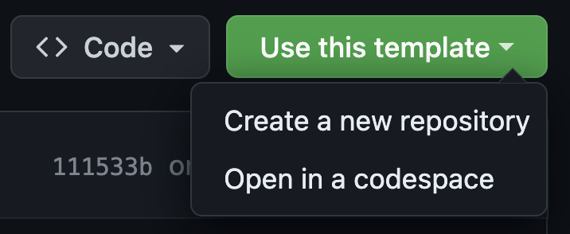
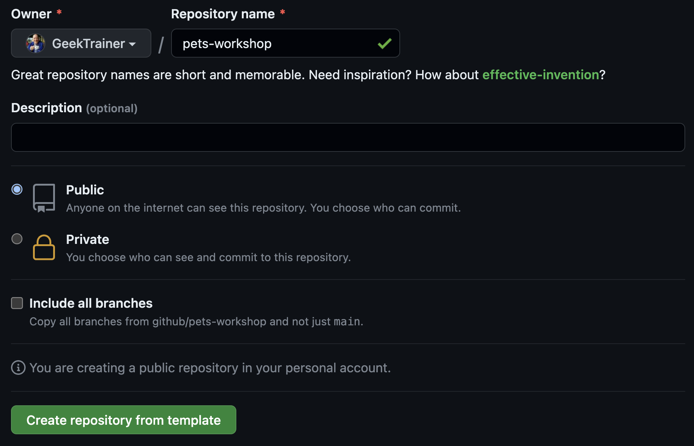

# Workshop setup

To complete this workshop you will need to create a repository with a copy of the contents of this repository. While this can be done by [forking a repository](https://docs.github.com/en/get-started/quickstart/fork-a-repo), the goal of a fork is to eventually merge code back into the original (or upstream) source. In our case we want a separate copy as we don't intend to merge our changes. This is accomplished through the use of a [template repository](https://docs.github.com/en/repositories/creating-and-managing-repositories/creating-a-template-repository). Template repositories are a great way to provide starters for your organization, ensuring consistency across projects.

The repository for this workshop is configured as a template, so we can use it to create your repository.

## Create your repository

Let's create the repository you'll use for your workshop.

1. Navigate to [github.com/github/pets-workshop](https://github.com/github/pets-workshop)
2. Select **Use this template** > **Create a new repository**

    

3. Under **Owner**, select the name of your GitHub handle.
4. Under **Repository**, set the name to **pets-workshop**.
5. Ensure **Public** is selected for the visibility.
6. Select **Create repository from template**.

    

In a few moments a new repository will be created from the template for this workshop!

## Summary and next steps

You've now created the repository you'll use for this workshop! Next let's [enable Code Scanning](1-code-scanning.md) to secure the code we write.
