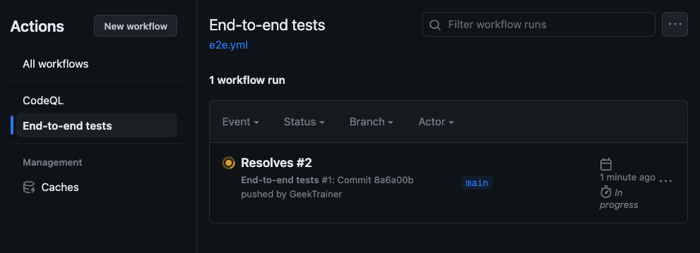

# Continuous integration and testing

Chances are you've heard the abbreviation CI/CD, which stands for continuous integration and continuous delivery (or sometimes continuous deployment). CI is centered on incorporating new code into the existing codebase, and typically includes running tests and performing builds. CD focuses on the next logical step, taking the now validated code and generating the necessary outputs to be pushed to the cloud or other destinations. This is probably the most focused upon component of DevOps.

CI/CD fosters a culture of rapid development, collaboration, and continuous improvement, allowing organizations to deliver software updates and new features more reliably and quickly. It ensures consistency, and allows developers to focus on writing code rather than performing manual processes.

[GitHub Actions](https://github.com/features/actions) is an automation platform upon which you can build your CI/CD process. It can also be used to automate other tasks, such as resizing images and validating machine learning models.

## Scenario

A couple of front-end tests have already been defined for the project using [Cypress](https://www.cypress.io/), a popular framework for testing. One of the tests includes checking for the component you'll be adding in a later exercise. To implement CI, you want to run these tests whenever new code is suggested or merged into the **main** branch of the project.

> **IMPORTANT:** Because the test will look for a component you have not yet created, it will fail when it runs for the first time. In an upcoming exercise you will add the code for the test to pass.

## Exploring the test

Let's take a look at the tests defined for the project.

> **NOTE:** There are only two tests defined for this project. Many projects will have hundreds or thousands of tests to ensure reliability.

1. Return to your codespace, or reopen it by navigating to your repository and selecting **Code** > **Codespaces** and the name of your codespace.
1. In **Explorer**, navigate to **src** > **cypress** > **e2e**, and open **app.cy.ts**.
1. Note the following test, which looks for an element with an id of `hours` and ensures the name of today is displayed:

    ```typescript
    it('should display todays day', () => {
      // start from the index page
      cy.visit('http://localhost:3000/')

      // get today's long day name
      const today = new Date().toLocaleDateString('en-US', { weekday: 'long' })

      // confirm div with id of hours has today's day
      cy.get('#hours').contains(today)
    })
    ```

## Creating the workflow

To run the tests, we'll need to perform a couple of steps. We need to create an environment in which the tests can run, to checkout the code, then run the tests with the appropriate configuration.

As you might expect, performing these types of actions is something numerous organizations need to do as part of their DevOps processes. To support these organizations, there is a [marketplace](https://github.com/marketplace?type=actions) hosted by GitHub containing actions for these and many other tasks. You can then create workflows which build upon these actions.

Workflows are defined as [YAML (or YML)](https://en.wikipedia.org/wiki/YAML) files, and stored as part of the project in a special folder named **.github/workflows**. By being part of the repository, they are subject to the exact same source controls as all other code. It also makes it easier to manage as everything you need is right there in the repository.

Let's create a workflow to implement testing.

1. In the root of your project in the **Explorer** window, navigate to **.github**.
1. Select the **New Folder** button in the **Explorer** window, and name it **workflows**.
1. Create a new file in the **workflows** folder by selecting **New File** in the **Explorer** window and name it **e2e.yml**.
1. In the new file, copy the following YML to create the workflow (we'll describe it in below this step):

    ```yml
    name: End-to-end tests
    on:
      push:
        branches: ["main"]
      pull_request:
        branches: ["main"]
    jobs:
      cypress-run:
        runs-on: ubuntu-20.04
        steps:
          - name: Checkout
            uses: actions/checkout@v3
          - name: Cypress run
            uses: cypress-io/github-action@v5
            with:
              build: npm run build
              start: npm run start
              project: ./src
            env:
              MONGODB_URI: test
    ```

    > **IMPORTANT:** YML is sensitive to tab/space levels. Ensure the tabbing is as displayed above.

### Explaining the workflow

To make this exercise easier, we provided the full YML for the workflow. Let's breakdown what's happening.

- `name`: Provides a name for the workflow, which will display in the logs.
- `on`: Defines when the workflow will run. In our case, it will run whenever new code is pushed (or merged) into `main`, or a pull request is made to `main`.
- `jobs`: Defines a series of jobs for this workflow. Each job is considered a unit of work.
    - `runs-on`: Where the operations for the job will be performed.
    - `steps`: The operations to be performed.

The `steps` section is broken down into two steps, each calling an action from the marketplace. The first is [checkout](https://github.com/marketplace/actions/checkout), which as the name implies, checks out your code. The trailing **@v3** pins the version of the action being used.

Next is [Cypress](https://github.com/marketplace/actions/cypress-io), which will run the tests. Note there are a couple of configuration options which need to be set:

- `build`: The build command for the project.
- `start`: The command to start the website.
- `project`: The location of the source code so Cypress can find the tests.
- `MONGODB_URI`: The location of the backend database to use for the project.

> **NOTE:** The application is configured to use [MongoDB In-Memory Server](https://github.com/nodkz/mongodb-memory-server) when `MONGODB_URI` is set to **test**. For sensitive values, you can create [encrypted secrets](https://docs.github.com/en/actions/security-guides/encrypted-secrets) for the repository.

## Push the workflow to the repository

With the workflow created, let's push it to the repository. Typically you would create a [pull request](https://docs.github.com/en/pull-requests/collaborating-with-pull-requests/proposing-changes-to-your-work-with-pull-requests/about-pull-requests) for any new code (which this is). To streamline the process, we're going to push straight to main as we'll be exploring pull requests and the [GitHub flow](https://docs.github.com/en/get-started/quickstart/github-flow) in a later exercise. You'll start by obtaining the number of the [issue you created earlier](./2-issues.md), creating a commit for the new code, then pushing it to main.

> **NOTE:** All commands are entered using the terminal window in the codespace.

1. Use the open terminal window in your codespace, or open it (if necessary) by pressing <kbd>Ctl</kbd> + <kbd>`</kbd>.
1. List all issues for the repository by entering the following command in the terminal window:

    ```bash
    gh issue list
    ```

1. Note the issue number for the one titled **Implement testing**.
1. Stage all files by entering the following command in the terminal window:

    ```bash
    git add .
    ```

1. Commit all changes with a message by entering the following command in the terminal window, replacing **<ISSUE_NUMBER>** with the number for the **Implement testing** issue:

    ```bash
    git commit -m "Resolves #<ISSUE_NUMBER>"
    ```

1. Push all changes to the repository by entering the following command in the terminal window:

    ```bash
    git push
    ```

Congratulations! You've now implemented testing, a core component of continuous integration (CI)!

## Seeing the workflow in action

Pushing the workflow definition to the repository counts as a push to `main`, meaning the workflow will be triggered. You can see the workflow in action by navigating to the **Actions** tab in your repository.

> **IMPORTANT:** The workflow **WILL FAIL** on the first run. This is expected. In the next exercise you will add the code to ensure the test passes.

1. Return to your repository.
1. Select the **Actions** tab.
1. Select **End-to-end tests** on the left side.
1. Note the tests running on the right side with a message of **Resolves <ISSUE_NUMBER>**, matching the commit message you used (and eventually failing).

    

1. When the test fails, select the name of the run (which should be similar to **Resolves <ISSUE_NUMBER>**). You will see the results of the test, which will be similar to the screenshot below:

    

You've now seen a workflow, and explore the details of a run!

## Summary and next steps

Congratulations! You've implemented automated testing, a standard part of continuous integration, which is critical to successful DevOps. Automating these processes ensures consistency and reduces the workload required for developers and administrators. You have created a workflow to run tests on any new code for your codebase. Let's turn our attention to [adding code to our project](./5-coding.md).

### Resources

- [GitHub Actions](https://github.com/features/actions)
- [GitHub Actions Marketplace](https://github.com/marketplace?type=actions)
- [About continuous integration](https://docs.github.com/en/actions/automating-builds-and-tests/about-continuous-integration)
- [GitHub Skills: Test with Actions](https://github.com/skills/test-with-actions)
