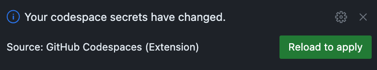

# Coding with GitHub Copilot as your AI pair programmer

Over the last several years we've seen the introduction of more powerful frameworks which allow us to create applications quickly and efficiently while programming has arguably become more complicated. We're deploying to complex environments. There's an increased learning curve for each new framework and language, with a growing collection of syntax we need to remember. And all of this while deadlines continue to shrink and requirements grow. It can be difficult to keep up as a developer, to stay in the zone, to be able to focus on what we love to do - create elegant solutions to difficult problems. GitHub Copilot is built to support us, to allow us to offload tedious tasks so we can pay attention to the bigger issues.

GitHub Copilot is a generative AI service trained on billions of lines of publicly available code and text. It synthesizes natural language prompts and code to generate suggestions of the next line or block of code, the next class or function you're hoping to implement. These suggestions are offered inline in the editor you're using allowing you to stay in the zone and be more efficient as a developer.

## Scenario

The shelter wants to add their hours to the webpage for the current day so people know when they can stop by to visit on that day. As this is something which could appear on multiple pages, it's best to create this as a [component](https://nextjs.org/learn/foundations/from-javascript-to-react/building-ui-with-components). For the time being, the component will be displayed solely on the homepage. To support the test, the output will be displayed in a `div` element with an id of `hours`.

> **IMPORTANT:** You do not need to have experience with Next.js to complete this exercise. A [solution file](../resources/solutions/Hours.js) is provided for you to use as a model or to simply copy.

### Store hours

| Day       | Hours         |
| --------- | ------------- |
| Monday    | 10:00 - 16:00 |
| Tuesday   | 10:00 - 16:00 |
| Wednesday | 10:00 - 16:00 |
| Thursday  | 10:00 - 16:00 |
| Friday    | 10:00 - 16:00 |
| Saturday  | 09:00 - 20:00 |
| Sunday    | 09:00 - 20:00 |

## Getting started with GitHub Copilot

GitHub Copilot is a cloud-based service offered for both individuals and businesses. As an individual, you can [sign up for a free trial](https://github.com/github-copilot/signup) of the service. After enrolling you will typically install the extension for your IDE, which is available for [Visual Studio](https://marketplace.visualstudio.com/items?itemName=GitHub.copilotvs), [Visual Studio Code](https://marketplace.visualstudio.com/items?itemName=GitHub.copilot), [NeoVIM](https://github.com/github/copilot.vim#getting-started) and the [JetBrains IDEs](https://plugins.jetbrains.com/plugin/17718-github-copilot). Because we'll be using the [codespace](./3-codespaces.md) you defined in the previous exercise, you won't need to manually install the extension - you did that when you configured the dev container!

> **IMPORTANT:** You can complete this exercise without GitHub Copilot by manually writing the code. You can also avoid coding altogether by copying and pasting from the [provided solution](../resources/solutions/Hours.js).

1. If you don't already have access to GitHub Copilot, [sign up for a free trial](https://github.com/github-copilot/signup).
1. In the [previous exercise](./3-codespaces.md) you configured your [devcontainer](https://docs.github.com/en/codespaces/setting-up-your-project-for-codespaces/adding-a-dev-container-configuration/introduction-to-dev-containers) to automatically install the extension for GitHub Copilot, so you're all set and ready to go!

## Creating the component

In our scenario, we want to display the hours for the shop. While this might typically be pulled from a database, in our example we'll hard-code it. You'll start by creating the component, then adding it to the homepage. Let's explore how GitHub Copilot can help streamline the process.

GitHub Copilot makes suggestions based on the comments and code you add. You can describe what you want to build in a comment or begin creating the code, and GitHub Copilot can offer a potential solution or the next line(s) of code. Because GitHub Copilot is AI, it is probabilistic rather than deterministic, meaning you may notice you will see different suggestions at different times. The first big tip for working with GitHub Copilot is to be flexible; if you don't see what you'd expect the first time, update the comment or code to provide more context.

### Component structure

React/Next.js components are created by first importing `React` from the React library. They're then typically created as a function exported at the end of the file:

```jsx
import React from "react";

const ComponentName = () => {
    // logic

    return (
        <div>
            HTML content
        </div>
    )
}

export default ComponentName;
```

### The logic

As we'll be hard-coding the hours, it'll be best to store these as an array of objects. Each object can have the name of the day (a property called `day`), and properties called `open` and `close` to store the opening and closing hours respectively. This could be stored as a variable named `shelterHours`.

After creating the array, we'll need code to store the name of current day, stored in a variable named `today`. Then we can find the current day's hours from `shelterHours`, storing it in a variable named `todayHours`. Finally, we can return some HTML displaying the open and close hours.

## Working with GitHub Copilot as your AI pair programmer

GitHub Copilot is designed to work with you as you write code and comments. It will see the current context, and generate suggestions for what it believes is the most likely next section of code. You can interact with GitHub Copilot by writing comments describing what you want to create, or by coding like you normally would. In either case, GitHub Copilot will continue to make suggestions.

You always have the ability to accept, reject, or modify any suggestions generated by GitHub Copilot. You may find the generated code isn't quite what you want, or is exactly what you need.

As you work with GitHub Copilot, it's important to remember that as it's built upon AI, it behaves in a probabilistic rather than a deterministic fashion. This means the suggestions offered may be different, even with the same prompts. As you're getting started with GitHub Copilot, you may want to explore some [best practices and use cases](https://github.blog/2023-06-20-how-to-write-better-prompts-for-github-copilot/) to get the most out of the tool.

### Creating the component with GitHub Copilot

Let's see how GitHub Copilot can help us quickly create the component. We're going to start by creating the core structure for the component. We'll then begin coding the array to store the store's hour, and see how GitHub Copilot will offer a suggestion to complete the rest of the objects. We'll then add a couple of comments to describe the necessary logic (getting today's date, finding today's hours, then displaying the results).

1. Return to your open codespace. If you closed the browser window, return to your repository and select **Code** then your codespace.
1. In the **Explorer** window, navigate to **src** > **components**.
1. Open the existing **Hours.js** file.
1. Below the existing comment, add the code to import `React` from React and create a new component named Hours:

    ```javascript
    import React from "react";

    const Hours = () => {
        // add logic

    }

    export default Hours;
    ```

1. Below the comment you added `// add logic`, begin creating the array by pasting the following code:

    ```javascript
    const shelterHours = [
        { day: "Monday", open: "10:00", close: "16:00" },

    ]
    ```

1. Place your cursor at the end of the line which reads `{ day: "Monday", open: "10:00", close: "16:00" },`. Press <kbd>Enter</kbd> (or <kbd>return</kbd> on a Mac). GitHub Copilot **should** suggest objects for the rest of the week!

    The suggestions from GitHub Copilot will appear as grey italicized text, similar to [IntelliSense](https://code.visualstudio.com/docs/editor/intellisense).

1. With the suggestion displaying on the screen, press <kbd>Tab</kbd> to accept the suggestion.

1. Modify the code to ensure the hours for Saturday and Sunday are correct. Your code will resemble the following:

    ```javascript
    const shelterHours = [
        { day: "Monday", open: "10:00", close: "16:00" },
        { day: "Tuesday", open: "10:00", close: "16:00" },
        { day: "Wednesday", open: "10:00", close: "16:00" },
        { day: "Thursday", open: "10:00", close: "16:00" },
        { day: "Friday", open: "10:00", close: "16:00" },
        { day: "Saturday", open: "09:00", close: "20:00" },
        { day: "Sunday", open: "09:00", close: "20:00" }
    ];
    ```

    > **IMPORTANT:** As highlighted earlier, GitHub Copilot is AI, meaning it is probabilistic rather than deterministic. The code generated may be different than what appears here. You can make modifications as appropriate, such as adding a comment to describe what you are looking to create, or updating the generated code.

1. Immediately below the newly created array, add a comment to describe the creation of a variable named `today` to store the long name of today's date:

    ```javascript
    // get the long day name and store it in a variable named today
    ```

1. GitHub Copilot will likely suggest the following code, which you can accept by pressing <kbd>Tab</kbd>:

    ```javascript
    const today = new Date().toLocaleDateString("en-US", { weekday: "long" });
    ```

1. Now that you have today's date, let's get the hours for today by asking GitHub Copilot to get them for us by adding a comment immediately below the newly created code:

    ```javascript
    // get today's hours
    ```

1. GitHub Copilot will likely suggest the following code, which you can accept by pressing <kbd>Tab</kbd>:

    ```javascript
    const todayHours = shelterHours.find(day => day.day === today);
    ```

1. Finally, ask GitHub Copilot to display today's hours:

    ```javascript
    // display today and the hours in an div with an id of hours
    ```

1. GitHub Copilot will likely suggest the following code line-by-line, which you can accept by pressing <kbd>Tab</kbd>:

    ```jsx
    return (
        <div id="hours">
            <h2>Today's Hours</h2>
            <p>{todayHours.day} {todayHours.open} - {todayHours.close}</p>
        </div>
    )
    ```

> **NOTE:** As highlighted, an example solution is provided for the [Hours.js](../resources/solutions/Hours.js) component.

## Add the Hours component to index.js

Let's finish out our coding by displaying the `Hours` component on **index.js**, which is the homepage.

1. In **Explorer**, open **src** > **pages** > **index.js**.
1. Under the comment which reads `// TODO: Import Hours component`, add the following code to import the `Hours` component:

    ```javascript
    import Hours from "../components/Hours";
    ```
    
    > **NOTE:** GitHub Copilot will likely make this suggestion automatically for you!

1. Under the comment which reads `{/* TODO: Display Hours component */}`, add the following code to display `Hours`:

    ```jsx
    <Hours />
    ```

Congratulations! You've now created a new component and added the code to the landing page to display it.

> **IMPORTANT:** If you enrolled for a GitHub Copilot trial, billing will start after the first 30 days. If you wish, you can [cancel your GitHub Copilot personal account](https://docs.github.com/en/billing/managing-billing-for-github-copilot/managing-your-github-copilot-subscription-for-your-personal-account#canceling-your-copilot-for-individuals-subscription) if you won't be using it.

## Running your website

With the updates made, you likely want to view the website. Let's start it and see the new component!

1. Return to your codespace. You will be prompted to **Reload to apply** your settings. Select **Reload to apply**.

    

1. After the codespace reloads, run your website in the codespace by entering the following command in the terminal window (using <kbd>Ctl</kbd> - <kbd>`</kbd> to open one as necessary):

    ```bash
    npm run dev
    ```

1. After the application starts, you will be presented with a dialog explaining your application is running on port 3000, which is now being forwarded.
1. Select **Open in Browser** in this dialog to open a new tab with your application.

    

1. You will now see a new tab with your website running! Your component should now display on the site.

    

1. Stop the website by returning back to your codespace, ensuring focus is on the terminal window, and selecting <kbd>Ctl</kbd> - <kbd>C</kbd>.

    > **IMPORTANT:** You can ignore any **favicon** errors.

## Summary and next steps

All developers write code with some form of assistance. This might come from a human pair programmer, copying/pasting code from a developer forum or documentation, or, in our case, and AI pair programer - GitHub Copilot. With GitHub Copilot, developers are able to focus on the bigger tasks while GitHub Copilot provides suggestions and generates code.

With the code added, it's time to use the GitHub flow to [incorporate your changes into the code base](./6-github-flow.md).

## Resources

- [GitHub Copilot](https://github.com/features/copilot)
- [How to use GitHub Copilot: Prompts, tips, and use cases](https://github.blog/2023-06-20-how-to-write-better-prompts-for-github-copilot/)
- [Getting started with GitHub Copilot](https://docs.github.com/en/copilot/getting-started-with-github-copilot)
- [GitHub Skills - Code with GitHub Copilot](https://github.com/skills/copilot-codespaces-vscode)
