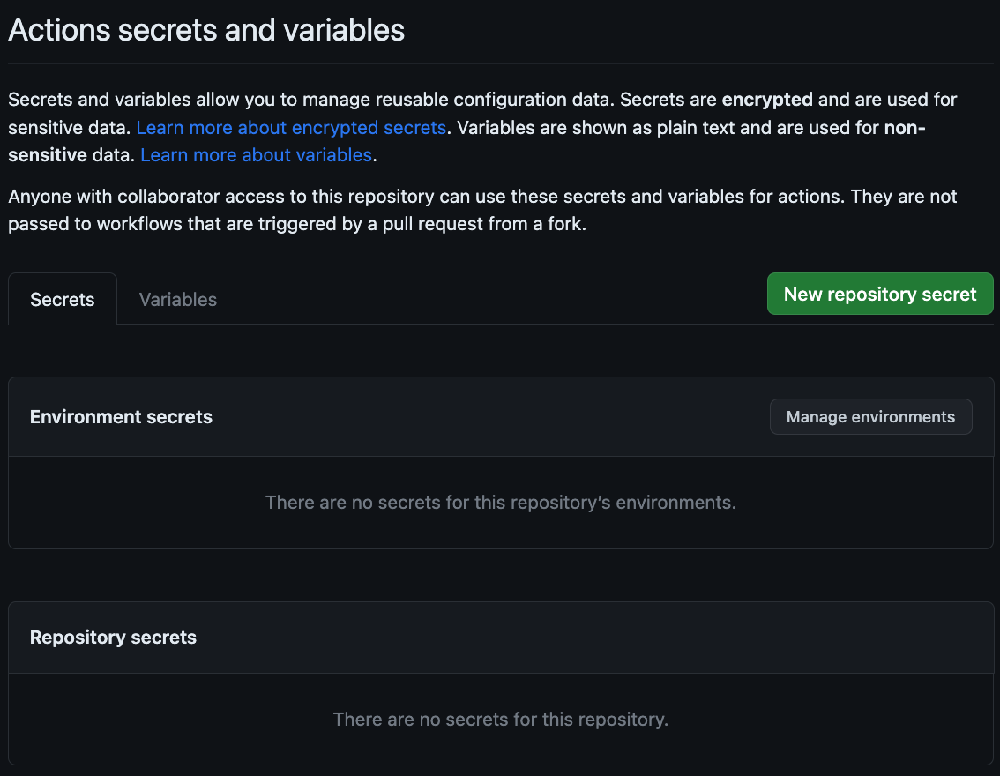
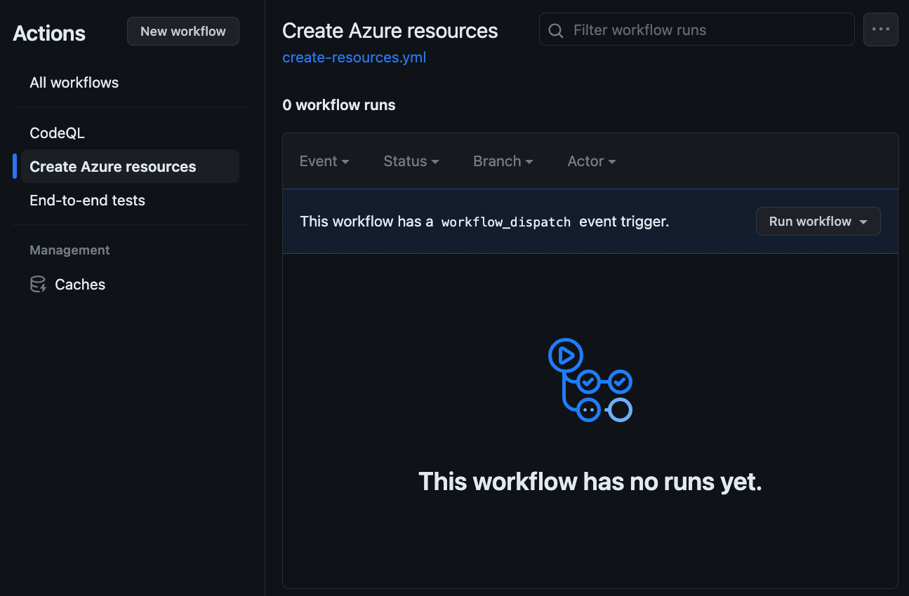

# Create a deployment environment

Creating the environment where our application will be deployed to is something which likely won't be done regularly. You'll create the environment when you first look to deploy the project, and maybe when it comes time to do some testing. As a result, this might not seem like something we would want to automate. Tasks which are run frequently, like unit testing, are obvious candidates for automation. But what about those which are run sporadically?

As it turns out, it can be argued that those which are run infrequently are just as important to be automated, if not more so. The reason is if a task isn't run regularly it's easier to miss steps or to lose time investigating what needs to be done. It's typically worth the initial investment up front building out an automated process which will payoff in the future by ensuring consistency and ease of use. Specific to creating a deployment environment, ensuring it's created correctly allows for the automated tasks to actually perform the deployment to run successfully.

With GitHub Actions, you can use `workflow_dispatch` as a trigger for [manual execution of workflows](https://docs.github.com/en/actions/using-workflows/manually-running-a-workflow). This is perfect for scenarios like creating a deployment environment.

## Scenario

With the project created, the code supply chain secured, and end-to-end testing implemented, the shelter is ready to begin deploying the project. They've selected [Azure](https://azure.microsoft.com/en-us/free) as the cloud provider. Specifically, they want to use [Azure Container Apps](https://learn.microsoft.com/en-us/azure/container-apps/overview) to host the website, and [Azure Cosmos DB for MongoDB](https://learn.microsoft.com/en-us/azure/cosmos-db/mongodb/introduction) as the backend database. A [Bicep file](../../../config/main.bicep) has already been created by another contractor. You want to create a new workflow to execute on demand to create the deployment environment.

> **NOTE:** For this exercise, a small amount of Azure credit will be required to store the website's image and the database. For the purposes of this workshop, the total amount should be less than $10US if you keep the website up for an entire month. At the end of the workshop, delete the resource group to ensure all billing stops.

## Infrastructure as code

[Infrastructure as code (IaC)](https://en.wikipedia.org/wiki/Infrastructure_as_code), also sometimes referred to as config as code, is a mechanism where the infrastructure required for an application is defined in a configuration file. There are numerous languages which support IaC, such as [Terraform](https://www.terraform.io/) and [Bicep](https://learn.microsoft.com/en-us/azure/azure-resource-manager/bicep/overview?tabs=bicep). By using IaC, the definition is created once and reused multiple times ensuring consistency. Rather than providing a list of instructions for a human to follow, a code file contains all of the necessary settings which is then used by an automated process (like GitHub Actions).

### Exploring the Bicep file

[Bicep](https://learn.microsoft.com/en-us/azure/azure-resource-manager/bicep/overview?tabs=bicep) is a domain specific language (DSL) created by Microsoft to describe and deploy Azure resources. With a Bicep file you can establish the services required, their configuration, and even set variables. This allows for flexibility and reuse, ensuring the environment is created correctly each time.

> **NOTE:** A full exploration of Bicep is beyond the scope of this workshop. A [Microsoft Learn course](https://learn.microsoft.com/en-us/training/paths/fundamentals-bicep/) is available if you would like to learn more.

1. Return to your open codespace. If you closed the browser window, return to your repository and select **Code** then your codespace.
1. In the **Explorer** pane, navigate to **config** and open **main.bicep**.
1. When prompted, install the **Bicep extension**. This will enable color coding of the file.
1. Note the following sections, each of which is used to create the necessary resources in Azure

    - `cosmos`
    - `logAnalytics`
    - `containerRegistry`
    - `containerAppEnvironment`
    - `containerApp`

    As highlighted before, by having these already defined in the file, we don't need to worry about creating these resources manually!

1. At the very top of **main.bicep**, note the `namePrefix` variable. This is used to ensure the names of every resource created in Azure will be unique.

## Create and configure the Azure resource group

All resources created in Azure are contained in resource groups. As the name implies, this allows you to group resources together. In our situation, this allows for streamlined management and permissions, and to speed cleanup as deleting the resource group will delete all associated resources. Let's create the resource group using the [Azure command-line interface (CLI)](https://learn.microsoft.com/en-us/cli/azure/what-is-azure-cli), and create a security principal with permissions to the resource group. This account will be used in the future to create the resources and deploy the website.

1. Return to your codespace.
1. If a terminal window isn't already open, open one by pressing <kbd>Ctl</kbd> - <kbd>`</kbd>.
1. Log into Azure via the Azure CLI by entering the following command:

    ```bash
    az login --use-device-code
    ```

1. Follow the on-screen prompts to complete the authentication process.
1. Create a resource group named **pets-workshop** by entering the following command:

    ```bash
    az group create -n pets-workshop -l westus
    ```

    > **NOTE:** If prompted to allow pasting through your browser, select **Allow**.

1. Obtain your Azure subscription ID (used in the next step) by entering the following command:

    ```bash
    az account show --query id -o tsv
    ```

1. Create the service principal to be used to manage the resource group by entering the following command, replacing **<SUBSCRIPTION_ID>** with your subscription ID obtained in the prior step,:

    ```bash
    az ad sp create-for-rbac --name pets-workshop-app --role contributor --scopes /subscriptions/<SUBSCRIPTION_ID>/resourceGroups/pets-workshop --sdk-auth
    ```

    This command will return a [JSON](https://en.wikipedia.org/wiki/JSON) object which serves as the credentials used to create the resources on Azure and deploy the project.

1. Copy the JSON to a scratchpad such as Notepad or Notes. You will use this object in the next step.

> **IMPORTANT:** The credentials provided from this step should be treated the same as any credential or username and password. It should be properly secured and not shared with anyone.

## Securing secrets in a repository

In the prior exercise you created a resource group and a credential with access to it. This credential should be treated as a sensitive value as an attacker could use it to perform undesired operations. The question then becomes, if this credential is to be used by our workflow, how do we ensure it's properly secured?

You can store sensitive values using [encrypted secrets](https://docs.github.com/en/actions/security-guides/encrypted-secrets). Encrypted secrets are write-only values which can be accessed by a workflow but cannot be read by other processes. This allows you to securely store connection strings, tokens and other credentials without fear of them being leaked to other processes.

Let's create the secrets required for our workflow.

1. In a new browser tab, navigate to your repository.
1. Select the **Settings** tab.
1. On the left side, expand **Secrets and variables** and select **Actions**.

    

1. Create a new repository secret to store the credentials by selecting **New repository secret**, entering the following values (replacing `<THE JSON FROM THE PRIOR STEP>` with the JSON you created previously), and selecting **Add secret**:

    - **Name**: `AZURE_CREDENTIALS`
    - **Secret**: `<THE JSON FROM THE PRIOR STEP>`

1. Create a second repository secret to store the subscription ID by selecting **New repository secret**, entering the following values (replacing `<SUBSCRIPTION_ID>` with your subscription ID), and selecting **Add secret**:

    - **Name**: `AZURE_SUBSCRIPTION`
    - **Secret**: `<SUBSCRIPTION_ID>`

## Creating variables for workflows

Not all values need to be secured. For sensitive information, like credentials or your subscription ID, it's best to store those properly. But other values, like the name of your resource group and the prefix you'll use for the other resources to be created, don't need to be hidden. These are perfect for variables. Variables behave in much the same way as secrets, except they're not encrypted or hidden from repository owners.

Let's create variables for the name of the resource group and your prefix:

1. On the **Actions secrets and variables** screen (the same screen you were on previously), select the **Variables** tab.
1. Create a variable for the name of the resource group by selecting **New variable**, entering the following values, and selecting **Add variable**:

    - **Name**: `AZURE_RG`
    - **Value**: `pets-workshop`

1. Create a variable for the prefix to use for naming other resources by selecting **New variable**, entering the following values, replacing `<PREFIX_NAME>` with five random letters (such as **aetel**), and selecting **Add variable**:

    - **Name**: `AZURE_PREFIX`
    - **Value**: `<PREFIX_NAME>`

## Creating the workflow

You've now configured Azure and added secrets & variables to your repository. You're now ready to create the workflow! This workflow will run on-demand, and create the resources on Azure. This will both make it easier to create everything and ensure it's done correctly.

1. Return to your codespace.
1. If the **Terminal** window isn't already open, open it by pressing <kbd>Ctl</kbd> - <kbd>`</kbd> on your keyboard.
1. Switch to the `main` branch, pull any changes currently on the server to your codespace, and create a new branch by entering the following command in the terminal window:

    ```bash
    git checkout main
    git pull
    git checkout -b add-resource-workflow
    ```

1. In the **Explorer** pane, open the **.github** > **workflows** folder.
1. Create a new file in the **workflows** folder named **create-resources.yml**.
1. Define the workflow by pasting the following code into **create-resources.yml**:

    ```yml
    name: Create Azure resources
    on: [workflow_dispatch]
    jobs:
      build-and-deploy:
        runs-on: ubuntu-latest
        steps:
    
          # Checkout code
          - uses: actions/checkout@main
    
          # Log into Azure
          - uses: azure/login@v1
            with:
              creds: ${{ secrets.AZURE_CREDENTIALS }}
    
          # Deploy Bicep file
          - name: create resources
            uses: azure/arm-deploy@v1
            with:
              subscriptionId: ${{ secrets.AZURE_SUBSCRIPTION }}
              resourceGroupName: ${{ vars.AZURE_RG }}
              template: ${{ github.workspace }}/config/main.bicep
              parameters: 'namePrefix=${{ vars.AZURE_PREFIX }}'
              failOnStdErr: false
    ```

    The workflow is set to run on `workflow_dispatch`, which is a manual trigger. The steps checkout the code, log into Azure using the credentials you created and stored previously, then create the resources defined in the **main.bicep** in the resource group you created with the prefix you defined. Notice how secrets are read by using `${{ secrets.NAME }}` and variables with `${{ variables.NAME }}`.

1. Stage, commit and push all changes to the repository by entering the following command in the terminal window:

    ```bash
    git add .
    git commit -m "Defined workflow"
    git push -u origin add-resource-workflow
    ```

1. Obtain the number for the issue you created for creating deployment environment by entering the following command in the terminal window:

    ```bash
    gh issue list
    ```

1. Create a pull request (PR) for the newly created branch referencing the issue, replacing <ISSUE_NUMBER> with the issue you obtained in the prior step by entering the following command in the terminal window:

    ```bash
    gh pr create -t "Add resource creation workflow" -b "Resolves #<ISSUE_NUMBER>"
    ```

1. Merge the PR you just created by entering the following command, replacing <PR_NUMBER> with the newly generated PR number, in the terminal window:

    ```bash
    gh pr merge <PR_NUMBER>
    ```

1. When prompted, press <kbd>Enter</kbd> (or <kbd>return</kbd> on a Mac) to create a merge commit.
1. When prompted, press <kbd>y</kbd> and press <kbd>Enter</kbd> (or <kbd>return</kbd> on a Mac) to delete the branch and return to `main`.
1. When prompted, press <kbd>Enter</kbd> (or <kbd>return</kbd> on a Mac) to submit the command.

    > **IMPORTANT:** Normally you would go through a standard review flow before merging a PR. Because we're working through a set of exercises as part of a workshop we're going to shortcut a couple of steps.

## Running the workflow

You've prepped everything on both Azure and your repository, and created the workflow. Only one last thing to do - run the workflow! This will create the environment on Azure for deploying the application (which you'll do in the next exercise).

1. Navigate to your repository.
1. Select the **Actions** tab.
1. On the list of workflows, select **Create Azure resources** to open the workflow page.

    

1. Run the workflow by selecting the **Run workflow** dropdown box then the **Run workflow** button**.

    The workflow will now run and create the resources! This will take several minutes. You may need to refresh the page to see it start running. Once running, you can navigate into the workflow run to view the log and track the progress.

## Summary and next steps

Congratulations! You have new defined a workflow which uses infrastructure as code (IaC) to create the resources necessary for deployment. This allows you to quickly create a consistent environment, reducing overhead and errors. Let's close everything out by [implementing continuous deployment](8-deployment.md).

## Resources

- [About continuous deployment](https://docs.github.com/en/actions/deployment/about-deployments/about-continuous-deployment)
- [GitHub Actions Marketplace](https://github.com/marketplace?type=actions)
- [GitHub Skills: Deploy to Azure](https://github.com/skills/deploy-to-azure)
