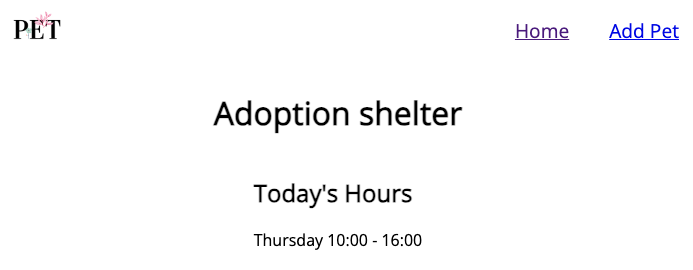

# Continuous deployment

As highlighted previously, continuous integration and continuous delivery/deployment (or CI/CD) are core to DevOps. They're all about incorporating new code into your existing code base (CI) and pushing the necessary artifacts to where they need to be (CD). And as we've learned, automation is key to success with DevOps as a whole, and CI/CD in particular. Let's explore the last step here, how to implement a CD flow to deploy your application.

## Scenario

Everything's ready to go! The initial application has been built. You've made the desired changes. You created the environment in the cloud to host the app. Now it's time to deploy! The shelter is excited to see their site go live. Let's create the workflow to deploy the application whenever new changes are pushed to `main`.

## Creating the workflow

In the [prior exercise](./7-create-environment.md) you created the environment on Azure and an account for management, and configured the repository with the necessary information to interact with said environment. As a result, you only need to define a new workflow to deploy the application. Let's use the [Azure Container Apps action](https://github.com/marketplace/actions/azure-container-apps-build-and-deploy) from the marketplace to deploy the project.

1. Return to your codespace, or reopen it by navigating to your repository and selecting **Code** > **Codespaces** and the name of your codespace.
1. If the **Terminal** window isn't already open, open it by pressing <kbd>Ctl</kbd> - <kbd>`</kbd> on your keyboard.
1. Switch to the `main` branch, pull any changes currently on the server to your codespace, and create a new branch by entering the following command in the terminal window and pressing <kbd>Enter</kbd> (or <kbd>Return</kbd> on a Mac):

    ```bash
    git checkout main
    git pull
    git checkout -b add-deploy-workflow
    ```

1. In the **Explorer** pane, open the **.github** > **workflows** folder.
1. Create a new file in the **workflows** folder named **deploy-to-azure.yml**.
1. Define the workflow by pasting the following code into **deploy-to-azure.yml**:

    ```yml
      name: Deploy to Azure
      on:
        push:
          branches:
            - main

      jobs:
        deploy:
          runs-on: ubuntu-latest
          steps:
            - name: Checkout code
              uses: actions/checkout@v3

            - name: Log in to Azure
              uses: azure/login@v1
              with:
                creds: ${{ secrets.AZURE_CREDENTIALS }}

            - name: Build and deploy Container App
              uses: azure/container-apps-deploy-action@v1
              with:
                appSourcePath: ${{ github.workspace }}
                acrName: ${{ vars.AZURE_PREFIX }}acr
                resourceGroup: ${{ vars.AZURE_RG }}
                containerAppName: ${{ vars.AZURE_PREFIX }}containerapp
                containerAppEnvironment: ${{ vars.AZURE_PREFIX }}containerappenvironment
    ```

    The workflow is set to run when code is pushed (or merged) into `main`. The deployment action is configured with the information it requires, using the naming defined in the creation workflow and the prefix you configured.

1. Stage, commit and push all changes to the repository by entering the following command in the terminal window and pressing <kbd>Enter</kbd> (or <kbd>Return</kbd> on a Mac):

    ```bash
    git add .
    git commit -m "Created deployment workflow"
    git push -u origin add-deploy-workflow
    ```

1. Obtain the number for the issue you created for implementing automated deployment by entering the following command in the terminal window and pressing <kbd>Enter</kbd> (or <kbd>Return</kbd> on a Mac):

    ```bash
    gh issue list
    ```

1. Create a pull request (PR) for the newly created branch referencing the issue, replacing <ISSUE_NUMBER> with the issue you obtained in the prior step by entering the following command in the terminal window and pressing <kbd>Enter</kbd> (or <kbd>Return</kbd> on a Mac):

    ```bash
    gh pr create -t "Add deployment workflow" -b "Resolves #<ISSUE_NUMBER>"
    ```

1. Merge the PR you just created by entering the following command, replacing <PR_NUMBER> with the newly generated PR number, in the terminal window and pressing <kbd>Enter</kbd> (or <kbd>Return</kbd> on a Mac):

    ```bash
    gh pr merge <PR_NUMBER>
    ```

    > **IMPORTANT:** Normally you would go through a standard review flow before merging a PR. Because we're working through a set of exercises as part of a workshop we're going to shortcut a couple of steps.

And that's it! Your workflow will now run!

## Monitor the workflow and open the site

Because merging the workflow's [YML](https://en.wikipedia.org/wiki/YAML) into `main` counts as a push to `main`, the workflow automatically runs. Let's track the progress and navigate to the site!

> **IMPORTANT:** It may take a couple of minutes for the workflow to appear and for it to run. If the workflow doesn't appear on the Actions tab initially, wait a few seconds and refresh the page.

1. Open your repository and select the **Actions** tab.
1. Select **Deploy to Azure** to open the information about this workflow.
1. When the workflow completes, return to your codespace.
1. Obtain the URL for the newly created Azure Container App by entering the following command in the terminal window:

    ```bash
    az containerapp list --query "[].properties.configuration.ingress.fqdn" -o tsv
    ```

1. When prompted to install the extension, press <kbd>Enter</kbd> (or <kbd>return</kbd> on a Mac) to approve the installation.
1. The URL for the site you created will be displayed. If multiple are displayed, select the one which starts with the prefix you created previously.
1. Select the URL and copy it to the clipboard.
1. Open a new tab and enter the URL to navigate to the page.
1. Your website now displays, running in the cloud!

  

1. If you wish, you can add a pet to the database by selecting **Add pet**. On the form you will notice various fields to describe the pet. If you need a URL for images, you can use any of the following:

    - https://raw.githubusercontent.com/github/pets-workshop/main/src/pics/roscoe.jpg
    - https://raw.githubusercontent.com/github/pets-workshop/main/src/pics/sammy.jpg
    - https://raw.githubusercontent.com/github/pets-workshop/main/src/pics/sushi.jpg

Any pets you register will be stored in the cloud-based database you defined in the prior exercise.

## Summary and next steps!

Congratulations!! You have now explored the core components to DevOps and how GitHub can support a common development lifecycle. You started by creating a repository, then enabled settings to secure your code. You created issues to track your work, created an environment in which to code, and enabled testing for continuous integration. You modified code and explored the GitHub flow. And finally you deployed your application to the cloud. Using these skills, you can continue to build and grow your knowledge of DevOps.

> **IMPORTANT:**: If you are no longer going to use the resources deployed to Azure, you can delete them by running the following command in the terminal window of your codespace:
> 
> `az group delete -n pets-workshop --yes`
> 
> The deletion of resources may take several minutes

## Resources

- [About continuous deployment](https://docs.github.com/en/actions/deployment/about-deployments/about-continuous-deployment)
- [Deploy to Amazon Elastic Container Service](https://docs.github.com/en/actions/deployment/deploying-to-your-cloud-provider/deploying-to-amazon-elastic-container-service)
- [Deploy to Google Kubernetes Engine](https://docs.github.com/en/actions/deployment/deploying-to-your-cloud-provider/deploying-to-google-kubernetes-engine)
- [GitHub Skills: Deploy to Azure](https://github.com/skills/deploy-to-azure)
